# System Flows

# SmartCare ICU
### AI-Powered Intensive Care Unit Management and Clinical Decision Support System

**Document Version:** 1.0
**Purpose:** Implementation-level reference. Every flow below specifies exact triggers, preconditions, step-by-step system behavior, decision branches, and failure paths — intended to be read alongside the SRS and Architecture documents during build.

---

# 1. How to Read This Document

Each flow includes:
- **Trigger** — what starts the flow
- **Preconditions** — what must already be true
- **Diagram** — sequence or flowchart showing exact steps, including branches
- **Notes** — edge cases, failure handling, and implementation details not obvious from the diagram alone

Flows are grouped into: **cross-cutting flows** (apply to nearly every action, shown once rather than repeated in every role flow), **role-specific flows** (one section per role), **system-internal flows** (run without direct user action), and a **full lifecycle flow** tying everything together.

---

# 2. Cross-Cutting Flows

These four flows are not role-specific — they wrap around almost every other flow in this document and are shown here once rather than redrawn in every section below.

## 2.1 Authentication & Session Flow

**Trigger:** User submits login credentials.
**Preconditions:** Account pre-provisioned by System Admin.

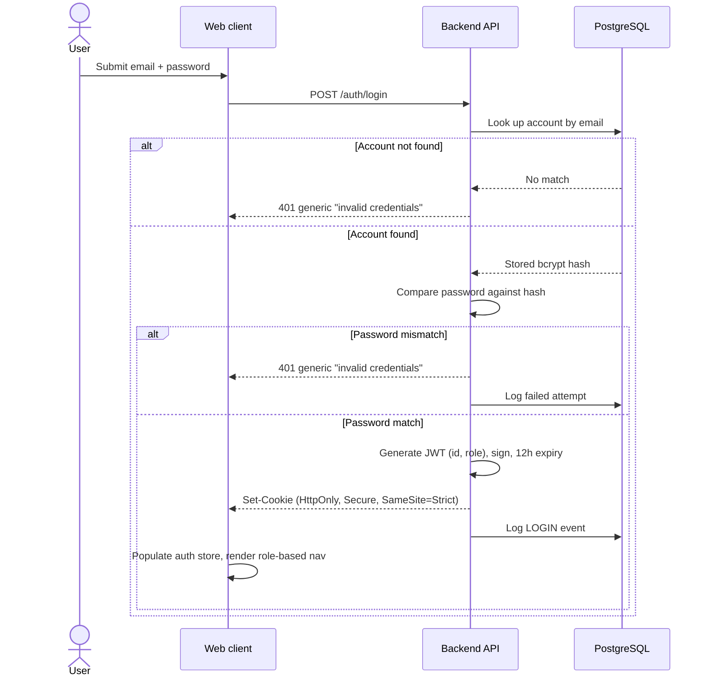

**Notes:**
- After 5 failed attempts on one account within 15 minutes, the account is temporarily locked and flagged for System Admin review.
- The cookie is never readable by client-side JavaScript — the frontend confirms session state via a `GET /auth/me` call, not by reading the cookie itself.

## 2.2 Authorization Check Flow (every protected request)

**Trigger:** Any request to a protected API route.

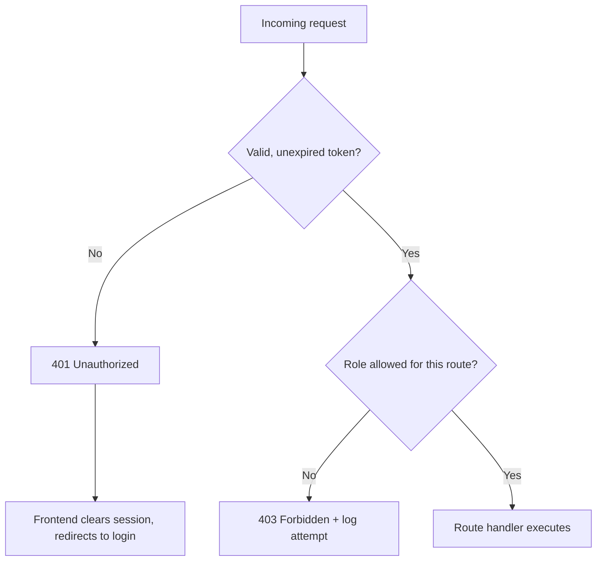

**Notes:** This check runs on literally every clinical, AI, and admin route. It is implemented as two middleware functions in sequence (`verifyToken`, then `requireRole([...])`) so the same authorization logic is never duplicated per-route.

## 2.3 Audit Logging Flow (every write action)

**Trigger:** Any create, update, archive, or AI-query action.

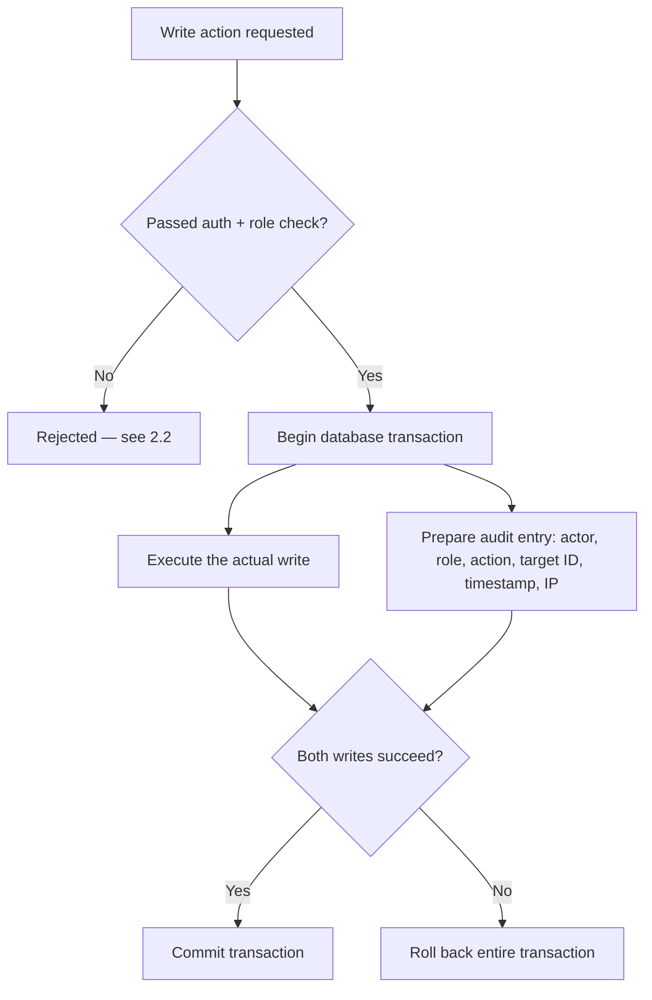

**Notes:** The audit entry is written in the **same transaction** as the underlying action. This guarantees a write can never succeed without a matching audit record — there is no code path where the two can diverge.

## 2.4 Soft Deletion Flow

**Trigger:** A delete/archive request for any clinical record.

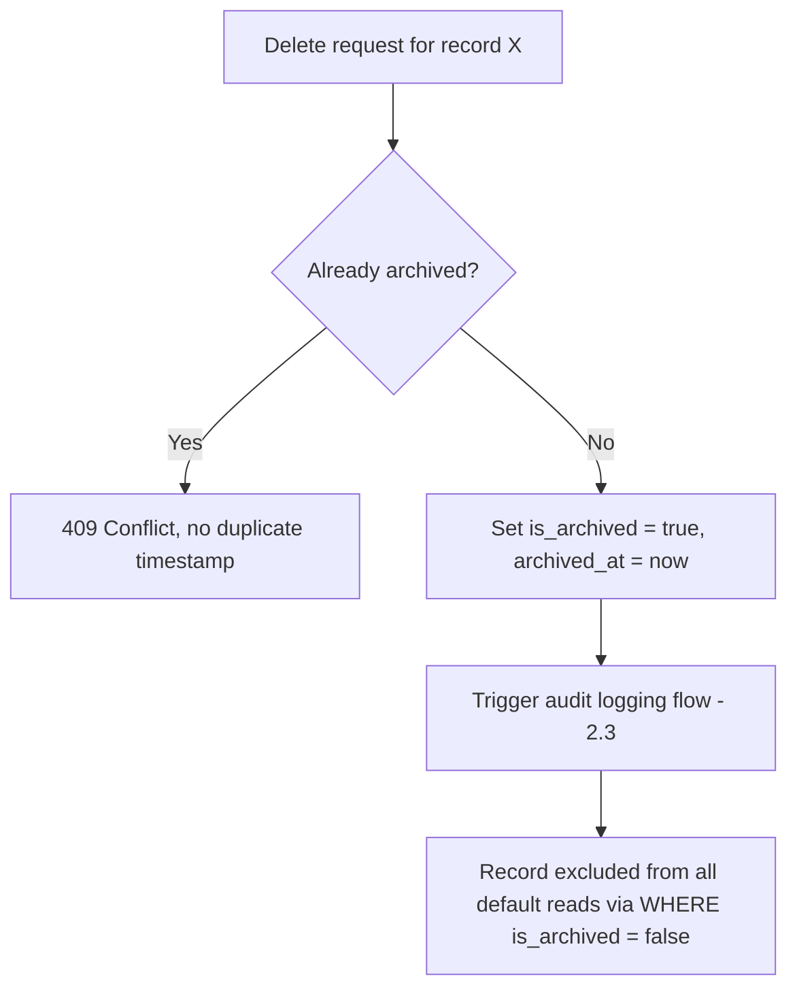

**Notes:** No endpoint in the system issues a SQL `DELETE` against a clinical table — this is enforced at the application code level, not just by convention.

---

# 3. Role Flow: System Admin

The System Admin never touches clinical data. All flows below are administrative only.

## 3.1 Create / Manage User Account

**Trigger:** Admin adds a new staff member or changes a role.

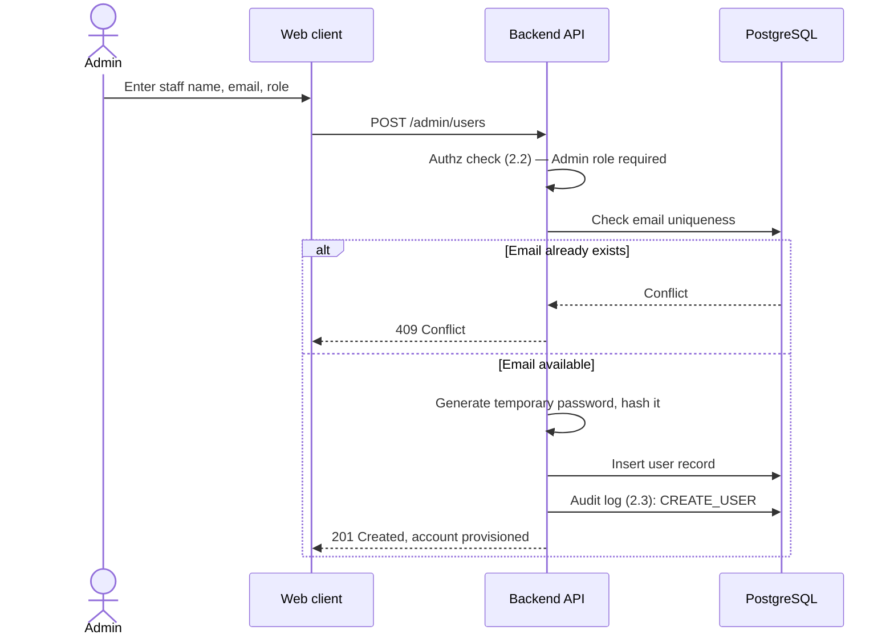

**Notes:** Role changes to an existing account (e.g., promoting a Resident to cover Specialist duties temporarily) follow the same pattern via `PATCH /admin/users/:id`, and are always audit-logged as a distinct `UPDATE_ROLE` action so role history is fully traceable.

## 3.2 Configure ICU Beds

**Trigger:** Admin adds, removes, or changes the status of a bed.

- `POST /admin/beds` — create a new bed (bed number, initial status `available`).
- `PATCH /admin/beds/:id` — update status (`available`, `occupied`, `maintenance`). Status is also updated automatically by the system when an admission is created or discharged (see Section 6).
- Every change follows the standard audit logging flow (2.3).

## 3.3 View System Health & Audit Trail

**Trigger:** Admin reviews system activity.
- Admin queries the `audit_logs` table via a read-only, non-clinical-data-scoped endpoint (`GET /admin/audit-logs`), filterable by user, action type, and date range.
- This endpoint explicitly excludes clinical field values from the response — it shows *that* a vitals record was created and *by whom*, never the vitals values themselves — enforcing the System Admin's "no clinical data" boundary described in the SRS at the API layer, not just the UI layer.

---

# 4. Role Flow: ICU Nurse

## 4.1 Admit a New Patient

**Trigger:** A new patient arrives in the ICU.

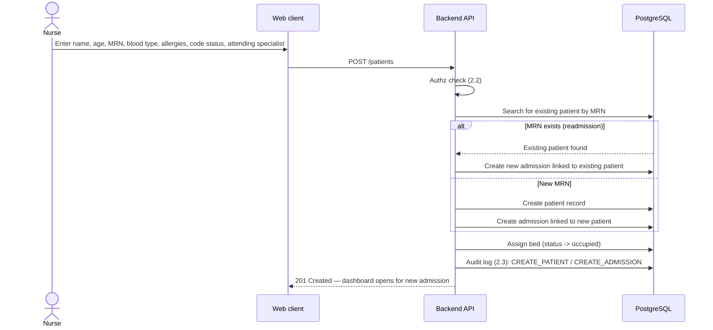

**Notes:** This is the one flow that determines whether a returning patient's history is correctly preserved (linked to the same `patient_id` across admissions) or incorrectly duplicated — MRN lookup must happen before any insert.

## 4.2 Record Vital Signs / GCS

**Trigger:** Hourly (or as-needed) bedside vitals check.

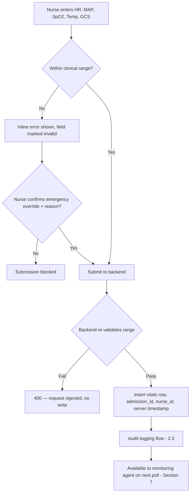

**Notes:** The server-side check is authoritative even if the frontend was bypassed — see SRS FR-1.2 exception handling. Timestamps are always server-generated, never trusted from the client, to prevent backdating.

## 4.3 Record Fluid Intake / Output

**Trigger:** IV bag change, feed administered, urine/drain output measured.
- `POST /vitals/fluid` — type (`IV`, `enteral`, `urine`, `drain`), amount in mL, timestamp (server-generated).
- Same validation → write → audit sequence as 4.2, without the physiological range check (fluid volumes are bounded only by sanity limits, e.g. non-negative).

## 4.4 Upload Lab / Radiology Document

**Trigger:** New lab result or imaging file arrives.

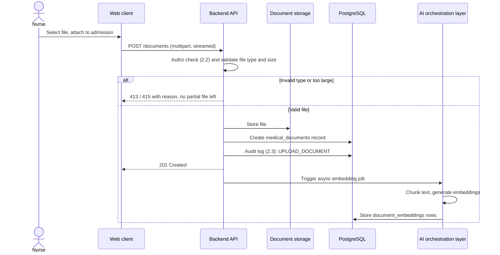

**Notes:** Embedding generation is asynchronous and does not block the upload response — the nurse sees confirmation immediately, while the document becomes RAG-queryable moments later.

## 4.5 Write Nursing Note

**Trigger:** Observation or care note during shift.
- `POST /notes/nursing` — free-text note, linked to admission and author.
- Standard validate → write → audit sequence.

## 4.6 Receive & Acknowledge Alert

**Trigger:** Monitoring agent raises a new alert (see Section 7).
- Alert appears in the top banner in real time (push, not polling) for the assigned Nurse.
- Nurse can view the alert but **cannot** dismiss/resolve it — only a Resident or Specialist can mark an alert reviewed (see 5.5), preserving clinical accountability for the review decision.

---

# 5. Role Flow: Medical Resident

## 5.1 Write Comprehensive Medical History

**Trigger:** Initial or ongoing clinical assessment.
- `POST /notes/clinical` — structured/free-text history, linked to admission and author (Resident or Specialist only — Nurses cannot write clinical notes, per the Access Control Matrix).
- Standard validate → write → audit sequence.

## 5.2 Query the RAG Assistant

**Trigger:** Resident asks a natural-language question about the current patient.

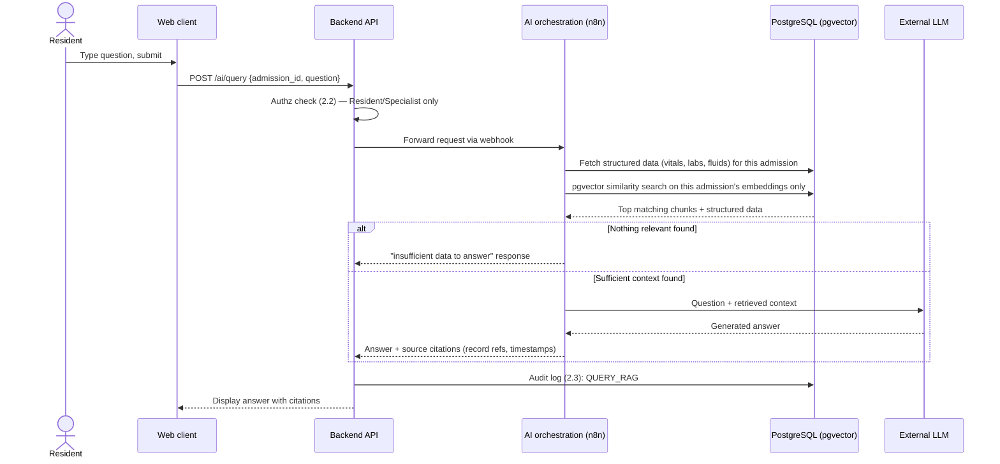

**Timeout branch:** if the orchestration layer or LLM does not respond within 6 seconds, the API returns a scoped "AI assistant temporarily unavailable" response — the rest of the dashboard is unaffected (see Section 9).

**Notes:** Retrieval is always scoped to the currently open `admission_id` — the similarity search query includes this as a hard filter, not just a ranking signal, so a resident can never accidentally retrieve another patient's data.

## 5.3 Trigger Instant AI Summary

**Trigger:** Resident (or Specialist) requests a 24-hour synthesis.

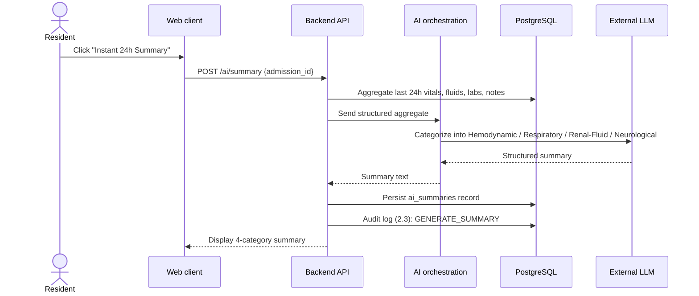

**Notes:** Categories with no data in the period explicitly state "no data recorded in this period" — the LLM is instructed never to fabricate a value for an empty category.

## 5.4 Review & Triage an Alert

**Trigger:** New P0/P1 alert appears in the banner.
1. Resident opens the alert from the banner or notification list.
2. Resident expands the **Clinical Reasoning & Differential** panel (always available, no hover required) showing triggering metrics, differential hypotheses, and suggested diagnostics.
3. Resident marks the alert **Reviewed**, which is a distinct action from dismissing it — the alert remains visible in the patient timeline permanently, only its active/reviewed status changes.
4. `PATCH /alerts/:id/review` writes the reviewing user, timestamp, and follows the standard audit logging flow.

---

# 6. Role Flow: ICU Specialist

## 6.1 Morning Rounds — Open Dashboard & Review

**Trigger:** Specialist begins rounds.
1. Opens the unified dashboard for a patient (directly, or via the sticky header's quick-switcher to move bed-to-bed without returning to a census screen).
2. Reviews the sticky context bar (identity, allergies, code status) — always visible regardless of scroll position.
3. Reviews vitals with trend sparklines, fluid balance, and any open alerts.
4. Triggers Instant AI Summary if not already generated this period (flow 5.3 — Specialists have the same trigger permission as Residents).

## 6.2 Approve Treatment Plan

**Trigger:** Specialist decides on a treatment modification.
- `POST /admissions/:id/treatment-approval` — restricted to Specialist role only in the authorization check (2.2); Residents and Nurses receive 403 if attempted.
- Follows standard audit logging flow, recorded as `APPROVE_TREATMENT`.

## 6.3 Discharge Patient

**Trigger:** Specialist determines the patient is ready to leave the ICU.

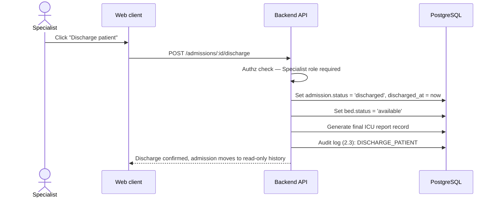

**Notes:** A discharged admission becomes read-only for clinical writes (see Section 8, admission state machine) — vitals/notes/documents can no longer be added against it, enforced at the authorization layer (returns 409, per SRS FR-1.4 exception handling), though it remains fully visible in the patient's history.

---

# 7. System-Internal Flow: Autonomous Monitoring Agent

**Trigger:** None — runs continuously on a fixed polling interval, independent of any user action.

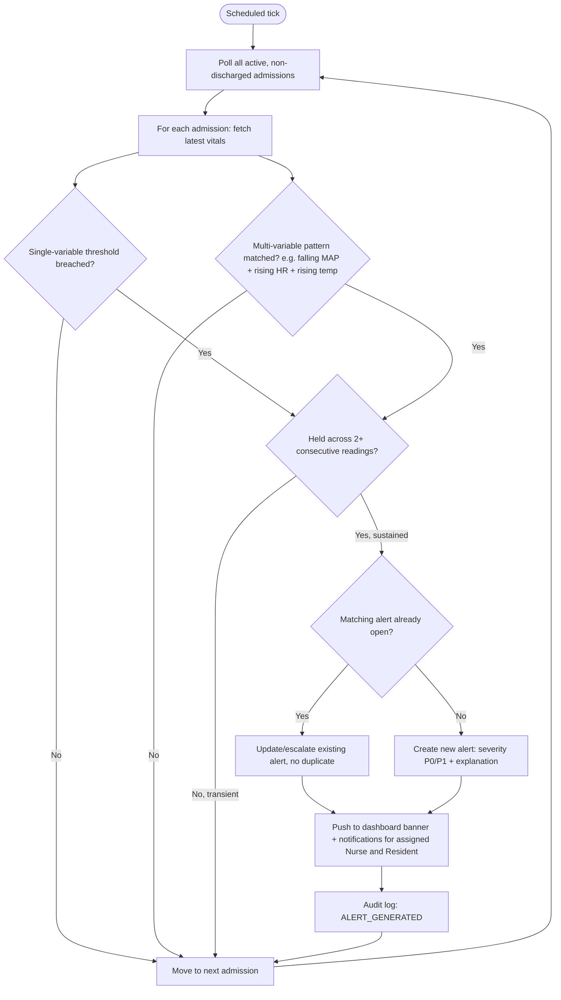

**Notes:**
- The debounce step exists specifically to reduce false positives from a single noisy sensor reading or manual-entry typo — the exact number of consecutive readings and polling interval are implementation parameters to finalize during development, not fixed here.
- The agent's write scope is strictly limited to the `alerts` and `notifications` tables — it has no permission, at the database or application layer, to modify a vitals, medication, or note record.
- Every alert generation is treated as a write action and follows the standard audit logging flow (2.3), attributed to the system agent as the "actor."

---

# 8. Admission State Machine

Referenced throughout the flows above — this is the exact lifecycle every admission moves through, and which actions are valid in each state.

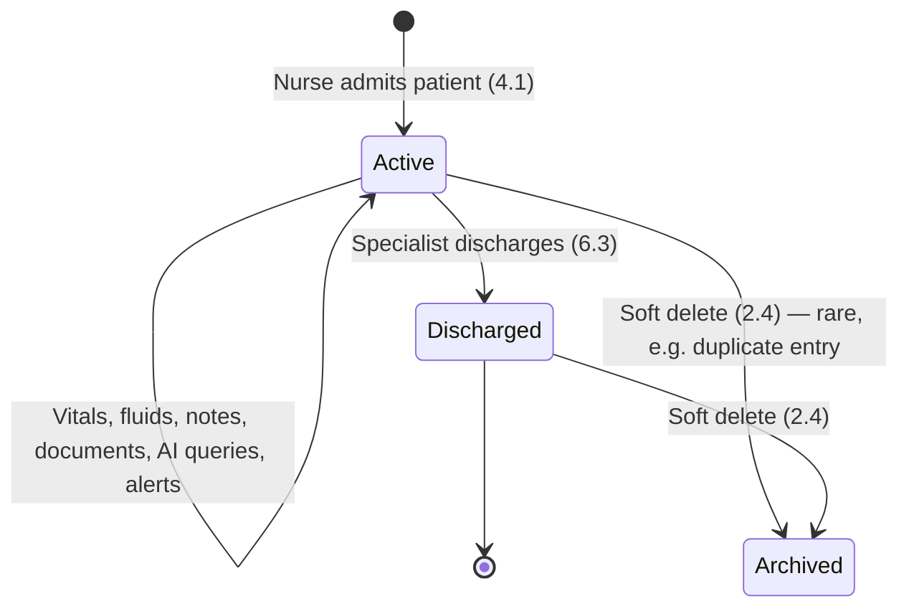

**Notes:** Only `Active` admissions accept new clinical writes. `Discharged` admissions are read-only but remain in standard views (patient history). `Archived` admissions (from either state) are hidden from default views entirely but never physically deleted.

---

# 9. Failure & Degradation Flow: AI Layer Unavailable

**Trigger:** AI orchestration layer or external LLM does not respond within 6 seconds, or returns an error.

```mermaid
flowchart TD
    AICall[Backend calls AI orchestration layer] --> Wait{Response within 6s?}
    Wait -- Yes --> Normal[Return AI result normally]
    Wait -- No / Error --> Fallback[Return scoped error to that feature only]
    Fallback --> Banner[Frontend shows AI Decision Support Temporarily Offline banner]
    Banner --> CoreIntact[Dashboard, vitals entry, and document upload remain fully functional]
```

**Notes:** This failure mode never blocks core clinical work — it is the direct architectural payoff of keeping the AI orchestration layer separate from the core request path (see Architecture document, Section 2).

---

# 10. Full Patient Lifecycle — All Roles Combined

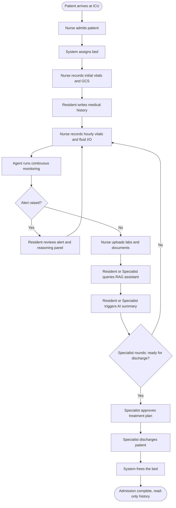

---

# 11. Flow-to-Requirement Traceability

| Flow | Section | Actor(s) | Related Requirement |
|---|---|---|---|
| Authentication & session | 2.1 | All roles | FR-1.1 |
| Authorization check | 2.2 | All roles | FR-1.1 |
| Audit logging | 2.3 | System (all writes) | FR-1.3 |
| Soft deletion | 2.4 | System (all deletes) | FR-1.3 |
| Manage users | 3.1 | System Admin | — |
| Admit patient | 4.1 | Nurse | FR-1.4 |
| Record vitals/GCS | 4.2 | Nurse | FR-1.2, FR-1.4 |
| Record fluid I/O | 4.3 | Nurse | FR-1.4 |
| Upload document | 4.4 | Nurse | FR-1.4 |
| RAG query | 5.2 | Resident, Specialist | FR-3.1 |
| AI summary | 5.3 | Resident, Specialist | FR-3.2 |
| Alert review | 5.4 | Resident, Specialist | FR-3.3, FR-3.4 |
| Treatment approval | 6.2 | Specialist | — |
| Discharge | 6.3 | Specialist | — |
| Monitoring agent | 7 | System | FR-3.3 |
| AI degradation | 9 | System | Non-functional (reliability) |
