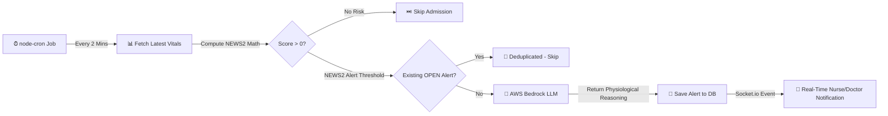
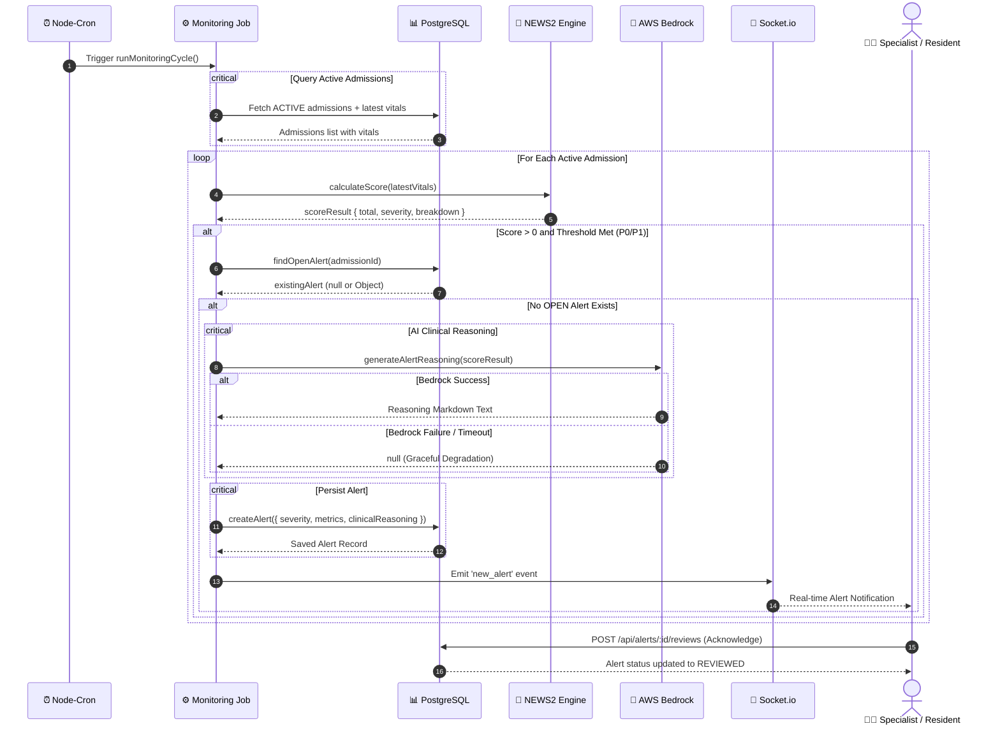

# AI Alerts & Clinical Reasoning

> [!NOTE]
> **AI Alerts & Clinical Reasoning** automatically monitors active ICU admissions, evaluates patient vital signs using the validated NEWS2 (National Early Warning Score 2) physiological scoring formula, and invokes AWS Bedrock to generate evidence-based clinical reasoning for triggered P0 (Critical) and P1 (Warning) alerts.

---

## 1. Quick Overview

### What is this?
An automated server-side monitoring pipeline that runs every 2 minutes. It scores the latest vital signs for every active ICU admission, identifies physiological deterioration based on NEWS2 thresholds, and uses an AI clinical reasoning engine to generate concise, objective physiological explanations for clinicians.

### Why do we need it?
In an intensive care unit, rapid physiological decline can occur within minutes. Manual vital sign calculations across all occupied beds introduce cognitive burden and delay intervention. This feature automates risk identification and instantly explains *why* a patient's NEWS2 score is elevated by connecting measured vital abnormalities to acute physiological instability.

### Who can use it?

| Role | Permissions |
| :--- | :--- |
| **ICU Specialist** | View ward-wide alerts, view admission alerts, submit clinical reviews & acknowledge alerts |
| **Medical Resident** | View ward-wide alerts, view admission alerts, submit clinical reviews & acknowledge alerts |
| **ICU Nurse** | View ward-wide alerts, view admission alerts (Read-only review history) |

---

## 2. How It Works (High-Level)

The alerts system operates entirely server-side without client-initiated triggers:



### The 6-Step Alert Lifecycle

1. **Scheduled Execution**: `node-cron` triggers `runMonitoringCycle()` every 2 minutes (`*/2 * * * *`).
2. **Deterministic NEWS2 Math**: The system fetches the latest vitals for all active admissions and evaluates physiological metrics using standard NEWS2 scoring rules.
3. **Deduplication Check**: If a score meets P0 (Score ≥7 or single score 3) or P1 (Score 5–6) thresholds, the system checks if an `OPEN` alert already exists for that admission. If an open alert is present, new alert creation is skipped.
4. **AI Reasoning Synthesis**: If no open alert exists, the abnormal vital parameters are formatted into a prompt payload and sent to AWS Bedrock to generate objective clinical reasoning.
5. **Database Persistence**: The alert is saved to PostgreSQL with status `OPEN`, containing severity, title, triggering metrics JSON, and AI clinical reasoning text.
6. **Real-Time Notification & Review**: Socket.io broadcasts the alert to online clinicians. A Specialist or Resident reviews the patient at bedside and submits review notes via `POST /api/alerts/:id/reviews`, transitioning the alert to `REVIEWED`.

---

## 3. AI Architecture & Implementation Pattern

### What AI Pattern Does This Feature Use?
This feature uses **Deterministic Mathematical Scoring + Context-Augmented Generation (CAG)**.

```text
┌────────────────────────────────────────────────────────┐
│     Deterministic Math + Context Injection (CAG)       │
├────────────────────────────────────────────────────────┤
│ 1. Scheduled Fetch    --> Latest Vitals per Admission  │
│ 2. Deterministic Math --> NEWS2 Scoring (P0 / P1 / 0)  │
│ 3. Deduplication      --> Check Active OPEN Alerts     │
│ 4. Prompt Injection   --> System Directives + Vitals   │
│ 5. LLM Inference      --> AWS Bedrock LLM Call         │
│ 6. Graceful Failover  --> Save Alert (AI text or null) │
└────────────────────────────────────────────────────────┘
```

---

### Codebase Evidence: Why Deterministic Math + CAG?

Looking at `server/src/modules/alerts/monitoring.job.js` and `server/src/modules/alerts/alertAi.service.js`:

1. **Severity decided by Math, NOT AI**: Severity (`P0` or `P1`) is calculated deterministically via `calculateScore(latestVitals)` in `news2.js`. Bedrock NEVER decides severity or alert thresholds.
2. **Context Injection**: Only the measured abnormal vitals (e.g., SpO₂ 89%, HR 135 bpm) and scores are passed into `generateAlertReasoning(scoreResult)`.
3. **Single Inference Step**: Bedrock is invoked synchronously during alert creation to explain the mathematical finding. No vector search or multi-turn loops are used.

---

### Pattern Comparison: How Does It Compare to Other AI Patterns?

| AI Pattern | Used Here? | How It Works | Why Chosen or Not Chosen |
| :--- | :---: | :--- | :--- |
| **Deterministic Math + CAG** | ✅ **YES** | Medical formulas (NEWS2) calculate exact score & severity; LLM provides natural language physiological reasoning. | **Essential for Patient Safety**: Clinical alerts must be 100% deterministic and reproducible. AI cannot hallucinate alert thresholds. |
| **Retrieval-Augmented Generation (RAG)** | ❌ **NO** | Vector search across document chunks. | **Not needed**: Alert triggering depends strictly on the most recent numerical vital signs snapshot. |
| **Direct AI Decision Support** | ❌ **NO** | LLM determines severity, diagnoses patient, or recommends medications. | **Prohibited**: AI acting as a clinical decision support or prescribing system presents patient safety risks. The AI functions purely as a clinical reasoning engine explaining physiological state. |

---

## 4. Core Capabilities & Architecture

The AI Alerts module consists of four primary subsystems:

```text
┌────────────────────────────────────────────────────────┐
│               AI Alerts Engine Subsystems              │
├───────────────────┬────────────────────────────────────┤
│ Subsystem         │ What It Does                       │
├───────────────────┼────────────────────────────────────┤
│ 1. Monitoring Job │ Cron job scanning active vitals    │
│ 2. NEWS2 Engine   │ Mathematical score & tier calculator│
│ 3. Reasoning Engine│ AWS Bedrock prompt & LLM service   │
│ 4. Review & Audit │ Status transition & review log DB  │
└───────────────────┴────────────────────────────────────┘
```

> [!TIP]
> **Why decouple scoring math from AI reasoning?**
> Decoupling guarantees patient safety: even if AWS Bedrock experiences downtime, rate limits, or network timeouts, the core alert (P0/P1) is still created and delivered to clinicians immediately with `clinicalReasoning = null`.

---

## 5. End-to-End Data Flow



---

## 6. API Reference Quick Card

Below are the feature endpoints:

### 1. Get Ward-Wide Alerts
* **`GET /api/alerts?status=OPEN&severity=P0`**
* **Access**: Nurse, Resident, Specialist
* **Returns**: HTTP 200 with list of ward-wide patient alerts including triggering metrics and AI reasoning.

### 2. Get Admission Alerts
* **`GET /api/admissions/:admissionId/alerts?status=OPEN`**
* **Access**: Nurse, Resident, Specialist
* **Returns**: HTTP 200 with active or historical alerts for a specific admission.

### 3. Review & Acknowledge Alert
* **`POST /api/alerts/:alertId/reviews`**
* **Access**: Resident, Specialist ONLY
* **Request Body**: `{ "reviewNotes": "Patient assessed at bedside...", "accepted": true }`
* **Returns**: HTTP 200/201 with review record. Flips alert status from `OPEN` to `REVIEWED`.

### 4. Get Alert Reviews Audit Trail
* **`GET /api/alerts/:alertId/reviews`**
* **Access**: Nurse, Resident, Specialist
* **Returns**: HTTP 200 with audit trail of clinician reviews for the specified alert.

---

## 7. Project Implementation & File Map

Here is where the code lives in this repository:

```text
├── server/
│   ├── prisma/
│   │   └── alert.prisma                      # Alert & AlertReview DB Schema
│   └── src/modules/alerts/
│       ├── alert.routes.js                   # Express Routes & Permission Middleware
│       ├── alert.controller.js               # HTTP Request Controllers
│       ├── alert.service.js                  # Database CRUD & Alert Deduplication
│       ├── alertAi.service.js                # AWS Bedrock Prompting & Reasoning Engine
│       ├── monitoring.job.js                 # 2-Minute Cron Monitoring Service
│       └── news2.js                          # Mathematical NEWS2 Scoring Formula
├── client/
│   └── src/features/
│       └── pages/patient/
│           └── PatientAlertsPage.jsx         # React Alerts & AI Reasoning UI
└── postman-collections/
    ├── AI_Alerts.postman_collection.json     # Dedicated AI Alerts Postman Collection
    └── Alerts.postman_collection.json        # Main Alerts Postman Collection
```

> [!IMPORTANT]
> **Alert Deduplication Rule**: An admission can have at most ONE `OPEN` alert at any time. New alerts for an admission are suppressed until a clinician reviews and acknowledges the existing open alert.

---

## 8. Key Design Decisions

> **Q: Why use NEWS2 instead of letting AI decide alert severity?**  
> A: NEWS2 is a clinically validated, standardized medical scoring system. Automated patient alerting must be 100% deterministic, predictable, and audit-compliant.

> **Q: Why are operational recommendations forbidden in the AI prompt?**  
> A: The alert framework itself already communicates urgency via P0/P1 badges and review workflows. Operational phrases like "immediate intervention required" add filler, whereas the AI should exclusively explain the physiological breakdown.

> **Q: How does the system handle Bedrock API latency or outages?**  
> A: The `alertAi.service.js` module wraps Bedrock calls in a try/catch block. If Bedrock times out or fails, it logs an error and returns `null`. The monitoring job continues uninterrupted and saves the alert with `clinicalReasoning: null`.

---

## 9. Failure Handling & Graceful Degradation

| Failure Scenario | System Behavior | Outcome |
| :--- | :--- | :--- |
| **Bedrock API Timeout / Outage** | `generateAlertReasoning()` catches error, logs warning, returns `null`. | Alert is created with `severity` and `triggeringMetrics`. `clinicalReasoning` is `null`. |
| **Bedrock Rate Limit (429)** | Catches HTTP 429 status code and falls back gracefully. | Alert creation succeeds without AI reasoning. |
| **Missing Vitals for Admission** | Monitoring cycle skips admissions without vitals. | No alert created. |
| **Existing OPEN Alert** | `findOpenAlert()` returns active alert record. | Monitoring cycle skips duplicate alert creation. |
| **Socket.io Uninitialized** | Catches socket error, logs warning. | Alert is saved in DB; real-time push skipped. |

---

## 10. Prompt Design & Clinical Directives

### System Prompt Directives (`SYSTEM_PROMPT` in `alertAi.service.js`)

The AI Clinical Reasoning service employs strict system directives to enforce physiological focus:

1. **Objective Physiological Focus**: 2–4 concise sentences explaining abnormal vital parameters.
2. **Mandatory Citation**: Explicitly cite all measured values (`SpO2: 89%`, `HR: 135 bpm`, `RR: 26/min`).
3. **Medical Terminology**: Use standard physiological terms (*hypoxaemia*, *tachypnoea*, *tachycardia*, *hypotension*).
4. **No Operational Recommendations**: STRICTLY FORBID phrases like *"immediate physician review"*, *"urgent assessment"*, or *"requires further investigation"*.
5. **No Medical Diagnoses**: Do not diagnose disease names or speculative conditions.
6. **No Treatment Prescriptions**: Do not recommend medications, dosages, or procedures.

---

## 11. Acceptance Criteria & Verification

- [x] Monitoring job executes automatically every 2 minutes.
- [x] NEWS2 scoring accurately calculates total score and severity (`P0` / `P1`).
- [x] Alert deduplication prevents multiple `OPEN` alerts per admission.
- [x] AI Clinical Reasoning cites measured vital signs and physiological abnormalities.
- [x] Bedrock failure degrades gracefully (`clinicalReasoning` set to `null` without throwing).
- [x] Clinician review via `POST /api/alerts/:id/reviews` transitions status to `REVIEWED`.
- [x] Postman collections validated with 100% test pass rate via Newman CLI.

---

## 12. Future Improvements

* 🔄 **Auto-Resolution**: Automatically mark alerts as `RESOLVED` when subsequent vitals return to normal NEWS2 ranges (Score = 0).
* 📈 **Multi-Reading Trend Analysis**: Feed 3–5 historical vital sign readings into Bedrock to explain physiological trajectory over time.
* 🌐 **Localization**: Provide multi-language clinical reasoning generation for regional hospital environments.
