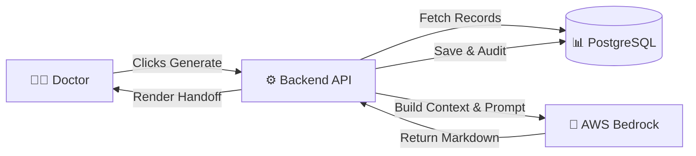
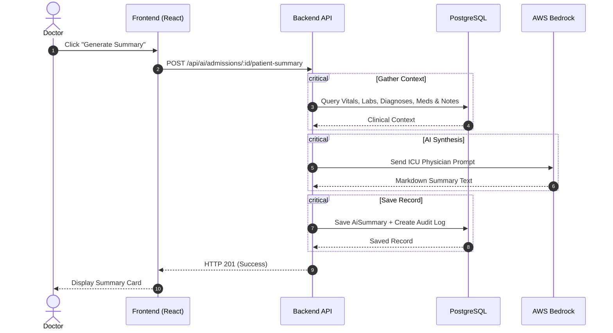

# AI Patient Summary

> [!NOTE]
> **AI Patient Summary** creates a concise medical summary for an ICU patient using their existing clinical data. Instead of reading dozens of records across multiple pages, doctors get one organized handoff summary in seconds.

---

## 1. Quick Overview

### What is this?
An AI assistant that scans a patient's ICU admission records—vitals, lab results, active diagnoses, medications, and clinical notes—and generates a structured physician handoff report.

### Why do we need it?
In an ICU, patient data changes constantly. During shift changes or morning rounds, reviewing every single chart manually takes 15–20 minutes. This feature distills everything into a 30-second readable summary.

### Who can use it?

| Role | Permissions |
| :--- | :--- |
| **ICU Specialist** | Generate summaries, view history, archive & restore |
| **Medical Resident** | Generate summaries, view history, archive & restore |
| **ICU Nurse** | View active summary history (Read-only) |

---

## 2. How It Works (High-Level)

Here is what happens when a doctor clicks **Generate Summary**:



### The 6-Step Summary Lifecycle

1. **Request**: Doctor triggers generation for a specific patient admission.
2. **Permission Check**: API verifies the user is an authorized doctor/resident.
3. **Data Gathering**: Backend collects vitals, lab results, active medications, diagnoses, and notes.
4. **AI Processing**: Aggregated data is formatted into an ICU physician prompt and sent to AWS Bedrock.
5. **Database Storage**: The generated Markdown summary is saved in the database with an audit log entry.
6. **Display**: The UI renders the summary formatted like a standard physician handoff.

---

## 3. AI Architecture & Implementation Pattern

### What AI Pattern Does This Feature Use?
This feature uses **Context-Augmented Generation (CAG)**, also known as **Structured Context Injection**. 

```text
┌────────────────────────────────────────────────────────┐
│             CAG (Context-Augmented Generation)         │
├────────────────────────────────────────────────────────┤
│ 1. Relational Query   --> Fetch Vitals, Labs, Notes    │
│ 2. Data Aggregation   --> Clean JSON Context Object    │
│ 3. Prompt Injection   --> Merge System Prompt + Context│
│ 4. LLM Inference      --> AWS Bedrock Model (Claude/Llama)
│ 5. Saved & Returned   --> Persisted to DB + Returned   │
└────────────────────────────────────────────────────────┘
```

---

### Codebase Evidence: Why CAG?

Looking at `server/src/modules/ai/patientSummary.service.js`:

1. **Deterministic Relational Queries**: `getAggregatedPatientData(admissionId)` executes exact PostgreSQL queries via Prisma for all records belonging to `admissionId`.
2. **In-Context Prompt Injection**: The complete context JSON is appended directly to `ICU_SUMMARY_SYSTEM_PROMPT` in a single request payload passed to `callBedrock()`.
3. **Single Inference Step**: No vector search, chunking, or multi-turn tool calling is performed.

---

### Pattern Comparison: How Does CAG Compare to Other AI Patterns?

| AI Pattern | Used Here? | How It Works | Why Chosen or Not Chosen |
| :--- | :---: | :--- | :--- |
| **Context-Augmented Generation (CAG)** | ✅ **YES** | Fetches 100% of an entity's structured data directly from SQL and injects it into prompt context. | **Ideal for patient summaries**: All patient data is already scoped to `admissionId` and small enough to fit inside modern LLM context windows (e.g., 200k tokens). |
| **Retrieval-Augmented Generation (RAG)** | ❌ **NO** | Uses vector embeddings & semantic search to retrieve document chunks from a vector database (e.g., pgvector). | **Not needed for summary**: RAG is used for open-ended search across thousands of documents. For a single patient admission, vector similarity search is unnecessary and risks missing vital records. |
| **Prompt Engineering** | ✅ **YES** | System directives guide LLM behavior, tone, evidence linking, and formatting. | **Used alongside CAG**: `ICU_SUMMARY_SYSTEM_PROMPT` instructs the LLM to write like an attending intensivist and format organ systems conservatively. |
| **Agentic AI / Tool Calling** | ❌ **NO** | LLM dynamically decides which APIs or functions to call in multi-turn loops. | **Not needed**: The data retrieval pipeline is 100% deterministic; the model does not need to decide which tools to call. |

---

## 4. Core Capabilities & Architecture

The feature is divided into four main capabilities:

```text
┌────────────────────────────────────────────────────────┐
│               AI Patient Summary Engine                │
├───────────────────┬────────────────────────────────────┤
│ Capability        │ What It Does                       │
├───────────────────┼────────────────────────────────────┤
│ 1. Context Fetch  │ Aggregates all patient EHR records │
│ 2. AI Synthesis   │ Generates summary via AWS Bedrock  │
│ 3. History View   │ Lists past active/archived summaries│
│ 4. Soft Delete    │ Archives/restores summaries        │
└───────────────────┴────────────────────────────────────┘
```

> [!TIP]
> **Why aggregate data first?**
> Sending pre-aggregated JSON to Bedrock ensures the AI receives complete, structured context in a single LLM request—saving API costs and preventing hallucinated patient details.

---

## 5. End-to-End Data Flow



---

## 6. API Reference Quick Card

Below are the 5 feature endpoints:

### 1. Generate Summary
* **`POST /api/ai/admissions/:admissionId/patient-summary`**
* **Access**: Specialist, Resident
* **Returns**: HTTP 201 with generated summary record.

### 2. Get Raw Clinical Context
* **`GET /api/ai/admissions/:admissionId/patient-context`**
* **Access**: Specialist, Resident
* **Returns**: HTTP 200 with raw aggregated EHR context (used for debugging/AI prompt testing).

### 3. Get Summary History
* **`GET /api/admissions/:admissionId/summaries?isArchived=false`**
* **Access**: Nurse, Resident, Specialist
* **Returns**: HTTP 200 with list of active or archived (`isArchived=true`) summaries.

### 4. Archive Summary (Soft Delete)
* **`DELETE /api/ai/summaries/:summaryId`**
* **Access**: Specialist, Resident
* **Returns**: HTTP 200 confirming summary was archived.

### 5. Restore Summary
* **`PATCH /api/ai/summaries/:summaryId/restore`**
* **Access**: Specialist, Resident
* **Returns**: HTTP 200 confirming summary was restored.

---

## 7. Project Implementation & File Map

Here is where the code lives in this repository:

```text
├── server/
│   ├── prisma/
│   │   └── ai.prisma                         # AiSummary DB Schema
│   └── src/modules/ai/
│       ├── ai.routes.js                      # Express Routes & Permission Middleware
│       ├── ai.controller.js                  # Request Handler & HTTP Responses
│       ├── ai.service.js                     # History, Soft Delete & Audit logic
│       ├── patientSummary.service.js         # Context Aggregation & Prompt Formatting
│       └── bedrock.client.js                 # AWS Bedrock Client
├── client/
│   └── src/features/
│       ├── pages/patient/
│       │   └── PatientAIAssistantPage.jsx    # React Summary UI Component
│       └── services/
│           └── aiService.js                  # Frontend API Hooks
└── postman-collections/
    └── SmartCare-ICU-AIPatientSummary-Wave15.postman_collection.json # API Tests
```

> [!IMPORTANT]
> **Data Retention Rule**: Summaries are never permanently deleted from the database. Archiving sets `is_archived = true` and `archived_at = NOW()`, preserving an immutable medical audit log.

---

## 8. Key Design Decisions

> **Q: Why AWS Bedrock?**
> A: AWS Bedrock provides enterprise-level security and HIPAA compliance with zero data storage of patient information by model providers.

> **Q: Why Soft Delete?**
> A: Medical records regulation requires retaining all patient care logs. Soft deletion hides redundant entries from doctors while keeping historical integrity intact.

> **Q: Why Postman Wave 15 Collection?**
> A: Keeping API requests in `SmartCare-ICU-AIPatientSummary-Wave15.postman_collection.json` allows developers to test setup, generation, archive, and restore flows in seconds without UI interaction.

---

## 9. Future Improvements

* ⚡ **Streaming Responses**: Stream AI output text in real-time as Bedrock generates it.
* 🌐 **Multi-Language Support**: Allow generating summaries in Arabic for regional medical staff.
* 🚀 **Snapshot Caching**: Cache recent summaries to reduce Bedrock API costs on duplicate requests.
